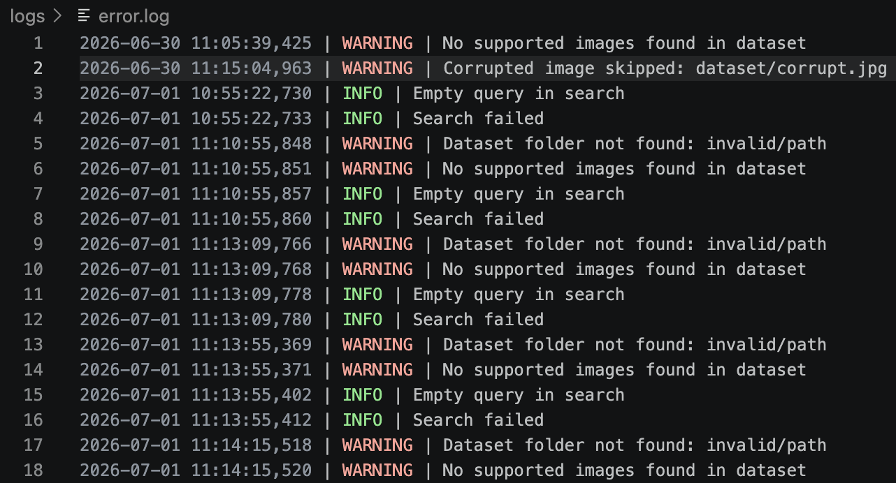
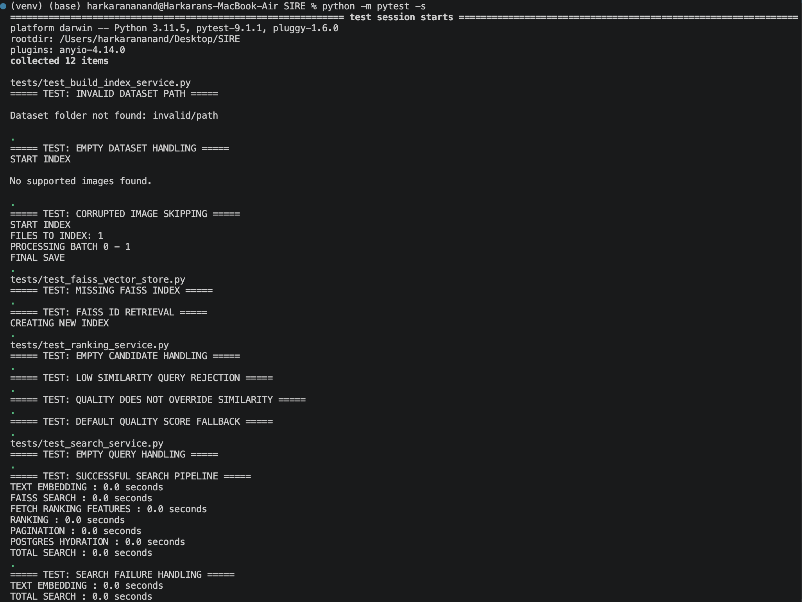

# Semantic Image Retrieval Engine (SIRE)


## Low-latency semantic image retrieval using natural language search.

SIRE is a backend system that transforms unstructured image collections into searchable vector representations through an offline indexing pipeline and retrieves semantically relevant images from natural language queries in milliseconds.

Instead of relying on filenames, folders, or manually assigned tags, SIRE understands the visual meaning of images using CLIP embeddings, performs fast similarity search with FAISS, and enriches the retrieved results with metadata stored in PostgreSQL.

---

## Live Demo

🌐 Demo: (Soon)

📘 Swagger API: (Soon)

---

## Search Preview


Users can search using natural language queries such as:

- "Office wear"
- "Yellow khadi kurti"
- "Black frill dress"
- "Marvel hoodies"
- "Red sneakers"


without requiring filenames or manually assigned tags.

---

## Search Pipeline

```
Natural Language Query
        │
        ▼
CLIP Text Encoder
        │
        ▼
FAISS Vector Search
        │
        ▼
Quality-aware Ranking
        │
        ▼
PostgreSQL Metadata Retrieval
        │
        ▼
Relevant Images Returned
```

---

# Why SIRE?

Traditional image retrieval systems depend on filenames, folders, or manually assigned labels to locate images.

These approaches fail when images are unlabeled or when users search using natural language.

SIRE solves this problem by representing both images and text within the same semantic embedding space using CLIP. During indexing, image embeddings are generated offline and stored inside a FAISS vector index, while image metadata is maintained separately in PostgreSQL.

At query time, the user's natural language is encoded into an embedding, matched against the FAISS index using cosine similarity, re-ranked using image quality, and finally hydrated with metadata before being returned to the client.

This architecture enables fast semantic retrieval while keeping vector search and metadata management independent.


# Engineering Highlights

### Offline Batch Indexing Pipeline

Images are processed through a fault-tolerant offline indexing pipeline that performs validation, image quality scoring, semantic embedding generation, cloud storage upload, vector indexing, and metadata persistence.

Unlike generating embeddings during search, all expensive computation is performed offline, allowing online queries to remain lightweight and low latency.

**Pipeline Stages**

- Image validation and corruption detection
- Blur detection using Variance of Laplacian
- Batch CLIP image embedding generation
- Batch Cloudinary uploads
- FAISS vector indexing
- PostgreSQL bulk metadata insertion
- Incremental checkpoint saving

---

### Semantic Vector Retrieval

Images and text are embedded into the same semantic vector space using CLIP.

During search:

- Natural language queries are converted into embeddings.
- FAISS performs cosine similarity search over precomputed image vectors.
- The top candidate images are retrieved within milliseconds.
- Metadata is fetched separately from PostgreSQL.

This enables searches based on image meaning rather than filenames or manually assigned tags.

---

### Hybrid Storage Architecture

SIRE separates vector search from metadata management.

| Component | Responsibility |
|-----------|----------------|
| **FAISS** | Stores image embeddings and performs nearest-neighbor search |
| **PostgreSQL** | Stores metadata, Cloudinary URLs, quality scores and indexing information |
| **Cloudinary** | Stores original images |

Separating vector search from relational metadata keeps retrieval efficient while allowing metadata to evolve independently.

---

### Quality-aware Ranking

Semantic similarity determines the primary relevance of search results.

To improve visual quality, SIRE performs an additional ranking stage where image quality acts as a lightweight tie-breaker without dominating semantic similarity.

```
Final Score =
Semantic Similarity
+
0.01 × Quality Score
```

Images that are semantically similar but visually sharper receive a small ranking boost.

---

## Fault Tolerance

The indexing and retrieval pipelines gracefully handle common failure scenarios.

### Offline Indexing

The indexing pipeline validates images and external services before persisting data.

| Scenario | Handling |
|----------|----------|
| Dataset folder missing | Indexing exits gracefully |
| Empty dataset | Indexing terminates safely |
| Unsupported file formats | Files skipped |
| Corrupted images | Image skipped, processing continues |
| Cloudinary upload failure | Exception raised and logged |
| PostgreSQL failure | Transaction rolled back |

---

### Online Retrieval

The retrieval pipeline validates requests and handles runtime failures without exposing internal implementation details.

| Scenario | Handling |
|----------|----------|
| Empty search query | Returns an empty result |
| Missing FAISS index | Runtime error raised |
| CLIP encoding failure | Search terminated safely |
| Database failure | Error logged and propagated |
| Invalid pagination | Automatically corrected |

---

## Logging

To simplify debugging and monitor pipeline execution, SIRE maintains separate log files for indexing, query execution, and runtime failures.

**Index Logs**

- Indexing started
- Batch processing
- Checkpoint creation
- Index completion

**Query Logs**

- Search query
- Pagination
- Result count
- Search completion

**Error Logs**

- Corrupted images
- Empty datasets
- Missing FAISS index
- Search failures
- Database rollback

This makes indexing progress and runtime failures easy to monitor and debug.

---

### Sample Logs

<p align="center">

</p>

---

## Performance Optimization

Several optimizations were introduced to reduce indexing time.

- Batch CLIP inference
- Batch Cloudinary uploads
- Bulk PostgreSQL inserts
- Batch FAISS indexing
- Periodic checkpoint persistence

These optimizations improved indexing throughput from approximately **75 images/minute** to over **500 images/minute** on the development machine.

### Benchmark Results

| Metric | Before Optimization | After Optimization |
|---------|--------------------:|-------------------:|
| Images / Minute | ~75 | **508+** |
| Improvement | — | **6.7× Faster** |

---

### Sample Output

<p align="center">

</p>


### Search Performance

Since all image embeddings are generated offline, online retrieval performs only lightweight operations.

Typical search flow:

```
Natural Language Query

↓

CLIP Text Encoding

↓

FAISS Vector Search

↓

Ranking

↓

Metadata Hydration

↓

Results
```

The retrieval pipeline avoids expensive image processing during search, enabling responsive query execution.

<p align="center">
image-retreival/Screenshot 2026-06-26 at 9.58.00 AM.png" width="850"/>
</p>


---

## Testing

SIRE includes **12 automated unit tests** covering the core retrieval pipeline, ranking logic, indexing workflow, and fault-tolerance scenarios.


### Test Coverage

| Component | Tests |
|-----------|------:|
| RankingService | 4 |
| SearchService | 3 |
| BuildIndexService | 3 |
| FAISSVectorStore | 2 |
| **Total** | **12** |

The test suite validates:

- Ranking correctness
- Similarity threshold filtering
- Quality-aware tie breaking
- Search pipeline execution
- Failure handling
- Indexing validation
- Corrupted image detection
- FAISS ID mapping

---

### Test Results

<p align="center">

</p>

```
========================================================
12 passed in 0.70s
========================================================
```

The tests focus on validating application logic rather than third-party libraries, ensuring the retrieval pipeline behaves correctly under both normal and failure scenarios.

# Architecture

SIRE follows a modular service-layer architecture that separates indexing, retrieval, vector search, metadata management, and storage into independent components.

This separation keeps the retrieval pipeline maintainable, model-agnostic, and allows individual components to evolve without affecting the rest of the system.

---

### Offline Indexing Pipeline

The offline pipeline processes images once and prepares them for fast semantic retrieval.

```
Dataset Images
        │
        ▼
Image Validation
        │
        ▼
Quality Scoring
        │
        ▼
Batch CLIP Image Embedding
        │
        ▼
Batch Cloudinary Upload
        │
        ├───────────────┐
        ▼               ▼
FAISS Index      PostgreSQL Metadata
        │               │
        └───────┬───────┘
                ▼
         Checkpoint Save
```

### Responsibilities

**Image Validation**

- Detect corrupted images
- Skip unsupported file formats

**Quality Scoring**

- Blur detection using Variance of Laplacian
- Assign image quality score

**Embedding Generation**

- Generate semantic image embeddings using CLIP
- Batch inference for improved throughput

**Cloudinary Storage**

- Upload validated images
- Store publicly accessible URLs

**FAISS Index**

- Store normalized image embeddings
- Map vectors using application-specific `faiss_id`

**PostgreSQL**

- Persist image metadata
- Store quality score, Cloudinary URL, filename, category and indexing status

---

### Online Retrieval Pipeline

The online pipeline retrieves semantically relevant images from natural language queries.

```
Natural Language Query
          │
          ▼
CLIP Text Encoder
          │
          ▼
FAISS Similarity Search
          │
          ▼
Top 200 Candidates
          │
          ▼
Quality-aware Ranking
          │
          ▼
Pagination
          │
          ▼
PostgreSQL Metadata Hydration
          │
          ▼
JSON Response
```

### Retrieval Flow

1. Encode the user's query into a CLIP embedding.
2. Search the FAISS index for the most similar image vectors.
3. Retrieve ranking features from PostgreSQL.
4. Apply semantic similarity and quality-aware ranking.
5. Paginate the ranked candidates.
6. Hydrate results with image metadata.
7. Return the final response to the client.

---

### Project Structure

```
SIRE/

├── app/
│
├── api/                # FastAPI routes
├── database/           # SQLAlchemy models and sessions
├── embeddings/         # CLIP embedding provider
├── indexing/           # FAISS index builder
├── quality/            # Image quality scoring
├── repositories/       # Database access layer
├── schemas/            # Request and response models
├── services/           # Indexing and search workflows
├── storage/            # Cloudinary integration
├── utils/              # Logging and timers
├── vector_store/       # FAISS retrieval
│
├── dataset/            # Images to index
├── storage/            # FAISS index
├── scripts/            # Offline indexing scripts
├── tests/              # Automated unit tests
└── requirements.txt
```

---

### Design Principles

SIRE was designed around a few core engineering principles.

- **Separation of Concerns** — Indexing, retrieval, storage, ranking, and persistence are isolated into independent modules.

- **Model Agnostic** — Services depend on abstract interfaces (`EmbeddingProvider`, `VectorStore`) rather than concrete implementations, making it possible to replace CLIP or FAISS with minimal changes.

- **Offline-First Processing** — Computationally expensive tasks such as embedding generation are performed during indexing rather than query time.

- **Hybrid Storage** — Dense vectors and relational metadata are stored independently to optimize retrieval performance and maintainability.

- **Fault Tolerant** — Failures during indexing and retrieval are detected and handled gracefully without interrupting the overall pipeline.

## Database Design

SIRE stores only image metadata in PostgreSQL while semantic vectors are maintained separately inside the FAISS index.

This hybrid architecture keeps vector search fast while allowing metadata to be queried and managed using a relational database.

---

### ImageAsset Model

Each indexed image is represented by a single database record.

| Field | Description |
|--------|-------------|
| id | UUID primary key |
| faiss_id | Unique identifier used by FAISS |
| file_name | Original image filename |
| category | Optional image category |
| image_url | Cloudinary URL |
| quality_score | Image quality score |
| index_status | Current indexing state |
| created_at | Index timestamp |

---

### Why Separate FAISS and PostgreSQL?

Instead of storing vectors directly inside PostgreSQL, SIRE separates retrieval into two independent layers.

```
Query
   │
   ▼
FAISS
(Vector Search)
   │
   ▼
Matching faiss_id
   │
   ▼
PostgreSQL
(Metadata)
```

This design provides several advantages:

- Fast nearest-neighbor vector retrieval
- Relational metadata management
- Independent scaling of vector search and metadata
- Simpler database schema

---

### Indexing Lifecycle

Every image progresses through a simple indexing lifecycle.

```
UPLOADED
     │
     ▼
INDEXED
```

This status can be extended in the future for workflows such as:

- FAILED
- PROCESSING
- REINDEXING

without affecting the retrieval pipeline.

---

### Design Trade-off

SIRE intentionally shifts computationally expensive operations from query time to indexing time.

This allows:

- Faster online search
- Lower query latency
- Better scalability as the dataset grows

The trade-off is a longer offline indexing process, which is acceptable because indexing is performed infrequently while search is executed repeatedly.


---


## Deployment

SIRE is deployed on Render for demonstration purposes.

The deployed application exposes:

- Semantic search interface
- FastAPI REST API
- Interactive Swagger documentation

---

### Live Demo

🌐 Demo: (Soon)

📘 Swagger: (Soon)

---

### Deployment Architecture

```
User
   │
   ▼
Render
   │
   ▼
FastAPI
   │
   ▼
Search Service
   │
   ├───────────────┐
   ▼               ▼
FAISS         PostgreSQL
   │
   ▼
Cloudinary Images
```

---

### Deployment Optimization

The complete SIRE pipeline performs live CLIP text embedding during query execution.

However, the Render free tier provides limited CPU resources, making repeated CLIP inference slow for public demonstrations.

To provide a responsive demo experience, the deployed version uses a small set of **precomputed query embeddings**.

Supported demo queries include:

- Blue Shirt
- Wireless Headphones
- White Sneakers
- Coffee Mug

The remainder of the retrieval pipeline remains unchanged.

This optimization affects only the deployed demo.

The local development version performs full real-time CLIP text encoding for arbitrary natural language queries.

---

### Why This Approach?

This deployment strategy was chosen because:

- Reduces CPU-intensive inference on Render's free tier.
- Improves response time during demonstrations.
- Preserves the retrieval, ranking, and metadata pipeline.
- Keeps the production architecture unchanged.

The optimization is purely deployment-specific and does not change the core system design.


---

## Local Setup

Clone the repository

```bash
git clone <repository-url>

cd Semantic-Image-Retrieval-Engine
```

Create a virtual environment

```bash
python -m venv venv

source venv/bin/activate
```

Install dependencies

```bash
pip install -r requirements.txt
```

---

## Environment Variables

Create a `.env` file.

Example:

```env
DATABASE_URL=postgresql://...

CLOUDINARY_CLOUD_NAME=...

CLOUDINARY_API_KEY=...

CLOUDINARY_API_SECRET=...
```

---

## Build the Index

Place your images inside the `dataset/` directory.

Run:

```bash
python scripts/build_index.py
```

The indexing pipeline will:

- Validate images
- Score image quality
- Generate CLIP embeddings
- Upload images to Cloudinary
- Build the FAISS index
- Store metadata in PostgreSQL

---

## Run the API

Start the FastAPI server

```bash
uvicorn app.main:app --reload
```

Swagger documentation:

```
http://127.0.0.1:8000/docs
```

Search preview:

```
http://127.0.0.1:8000/
```

---

## Example Search

Example queries:

- Blue Shirt
- Wireless Headphones
- White Sneakers
- Coffee Mug

---

## Future Improvements

- Replace exact vector search with approximate nearest-neighbor indexes such as HNSW or IVF for larger datasets.

- Introduce Redis caching for metadata hydration to reduce PostgreSQL lookups during repeated searches.

- Support image-to-image retrieval alongside text-to-image semantic search.

- Incorporate richer quality and aesthetic scoring models to improve ranking beyond blur detection.

- Add asynchronous indexing jobs for large-scale datasets and incremental index updates.

---

## Author

**Harkaran Anand**

B.Tech Computer Science & Engineering

MIT Manipal

